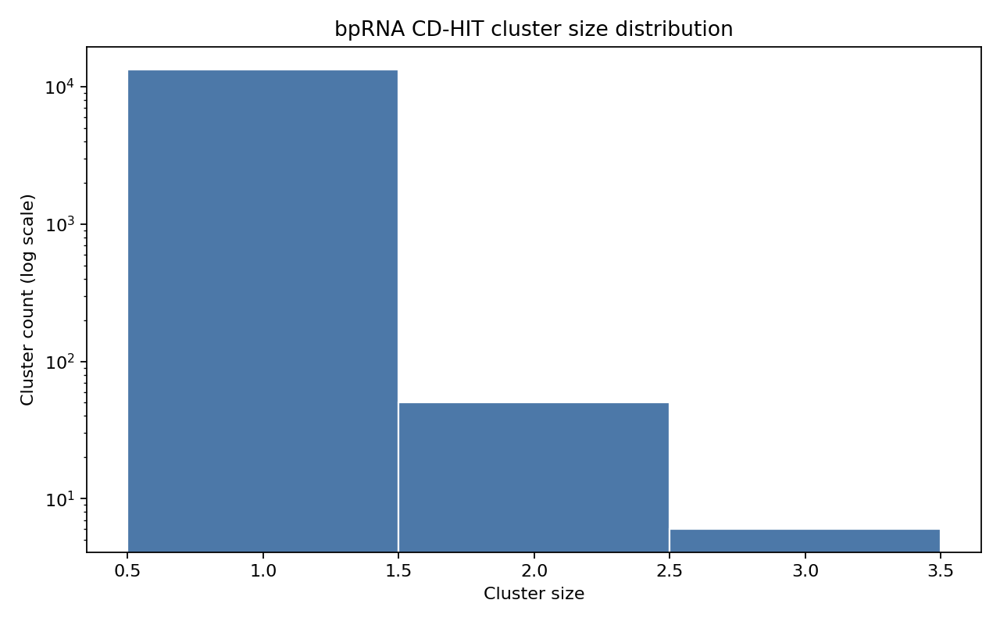
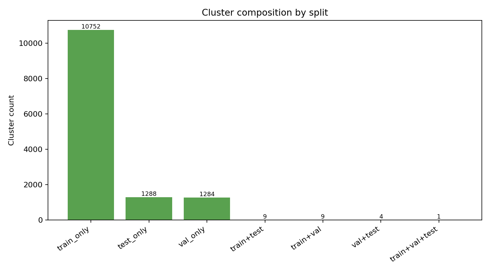
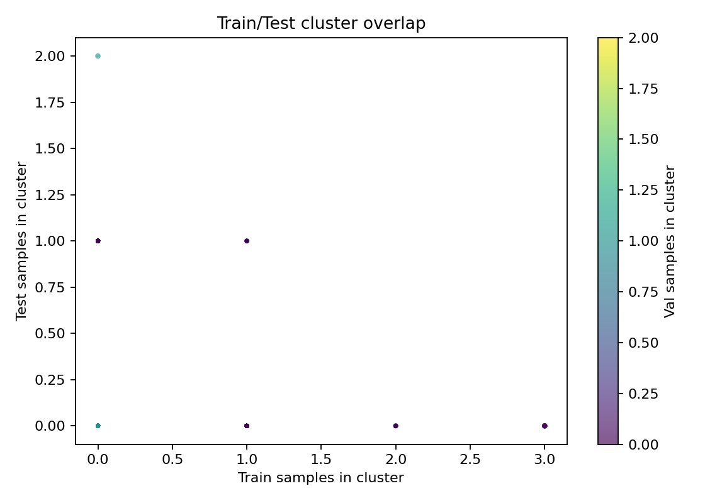
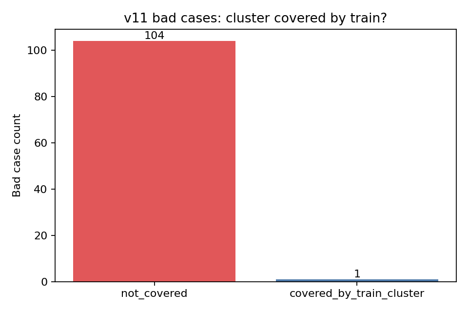
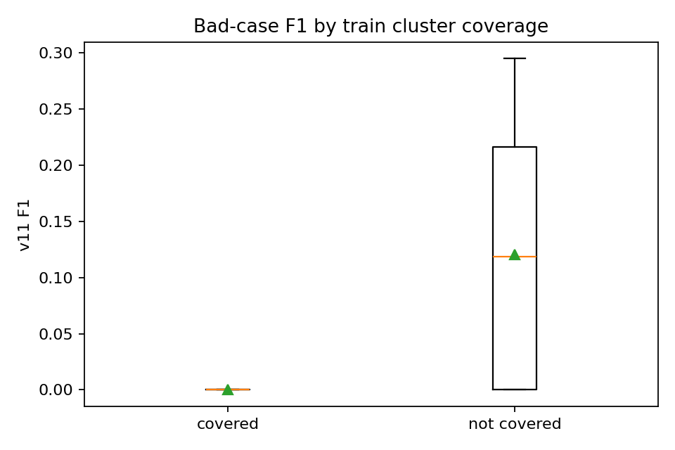
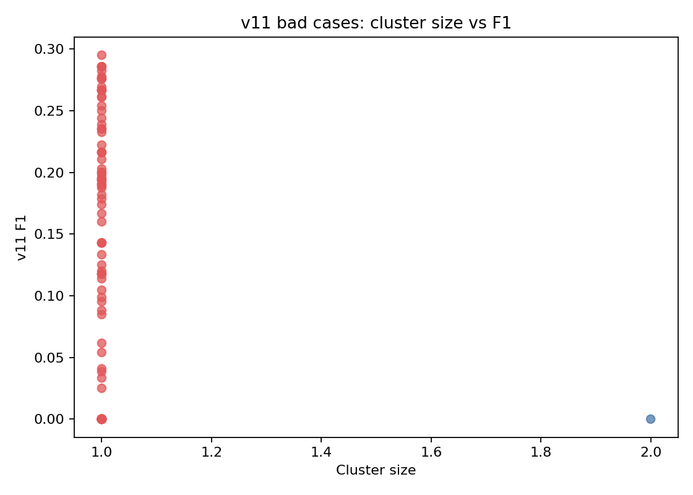
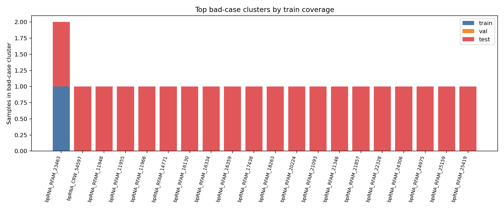
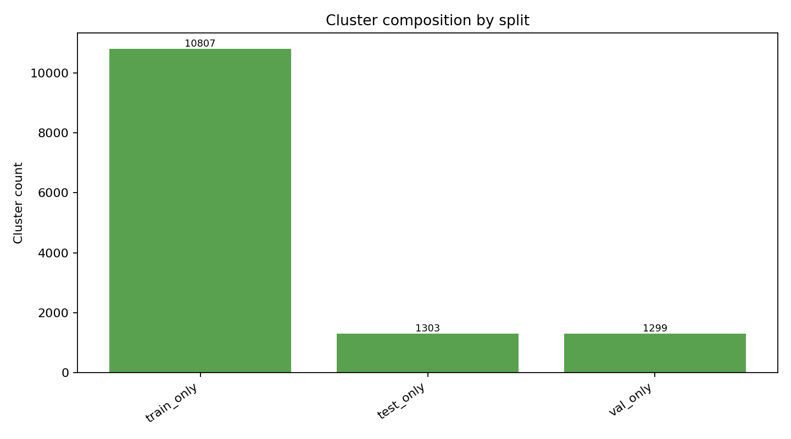
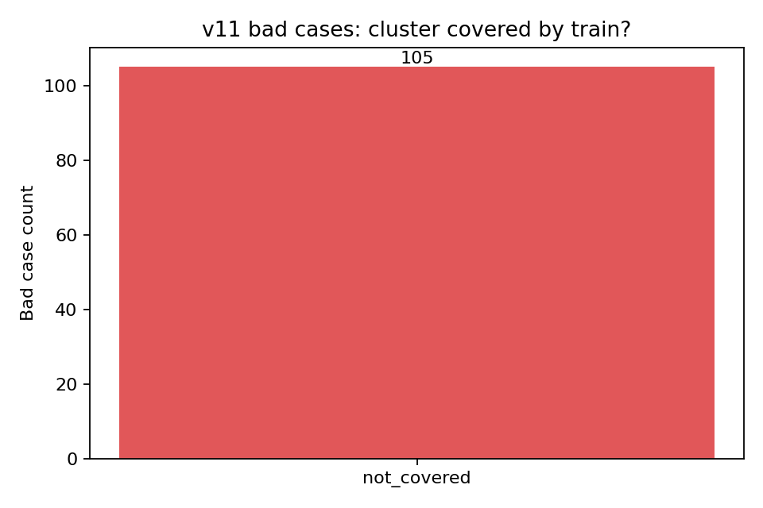

# bpRNA CD-HIT 聚类与 v11 Bad Case 覆盖分析报告

本文档汇总本次对 `/root/aigame/dannyyan/PriFold/data/bprna_cd_hit` 中 bpRNA FASTA 数据进行 CD-HIT 聚类后的统计结果，并分析 v11 bad cases 是否被 train 中相似样本覆盖。

## 1. 分析目标

本次分析回答两个问题：

1. 全量 bpRNA 在不同 identity 阈值下有多少 cluster，每个 cluster 中有多少来自 `train/val/test`。
2. v11 版本测试集 bad cases 属于哪些 cluster，这些 cluster 中是否存在 train 样本；如果存在，导出对应 train 样本。

同时生成了若干可视化图，用于观察 cluster size、跨 split 覆盖关系、bad case 覆盖情况等。

## 2. 输入数据与脚本

输入 FASTA 目录：

```bash
/root/aigame/dannyyan/PriFold/data/bprna_cd_hit
```

使用的 FASTA：

```bash
/root/aigame/dannyyan/PriFold/data/bprna_cd_hit/bprna_all.fa
/root/aigame/dannyyan/PriFold/data/bprna_cd_hit/bprna_train.fa
/root/aigame/dannyyan/PriFold/data/bprna_cd_hit/bprna_val.fa
/root/aigame/dannyyan/PriFold/data/bprna_cd_hit/bprna_test.fa
```

v11 per-sample 结果：

```bash
/root/aigame/dannyyan/PriFold/symfold/outputs/v11/comprehensive_analysis/per_sample_results.json
```

新增分析脚本：

```bash
/root/aigame/dannyyan/PriFold/symfold/eval/analyze_bprna_cd_hit_clusters.py
```

运行环境：

```bash
/root/aigame/dannyyan/miniconda3/bin/conda run -n RNADiffFold_torch260
```

## 3. CD-HIT 参数

统一使用 `cd-hit-est` 对全量 `bprna_all.fa` 聚类，然后解析 `.clstr` 得到每个样本所属 cluster。

默认公共参数：

```bash
-d 0 -M 16000 -T 8 -g 1 -r 0 -aS 0.9 -aL 0.9
```

含义：

| 参数 | 含义 |
|---|---|
| `-d 0` | `.clstr` 中保留完整 FASTA header |
| `-M 16000` | 最大内存 16000 MB |
| `-T 8` | 8 线程 |
| `-g 1` | 更精确的聚类模式 |
| `-r 0` | 只比较同方向，不考虑反向互补 |
| `-aS 0.9` | 短序列覆盖率至少 90% |
| `-aL 0.9` | 长序列覆盖率至少 90% |

本次测试了三档 identity：

| identity | word size | 输出目录 |
|---:|---:|---|
| `0.95` | `10` | `symfold/outputs/bprna_cd_hit_analysis` |
| `0.90` | `8` | `symfold/outputs/bprna_cd_hit_analysis_c090` |
| `0.80` | `5` | `symfold/outputs/bprna_cd_hit_analysis_c080` |

## 4. 运行命令

### 4.1 95% identity

```bash
cd /root/aigame/dannyyan/PriFold
/root/aigame/dannyyan/miniconda3/bin/conda run -n RNADiffFold_torch260 \
  python symfold/eval/analyze_bprna_cd_hit_clusters.py \
  --identity 0.95 \
  --word-size 10
```

### 4.2 90% identity

```bash
cd /root/aigame/dannyyan/PriFold
/root/aigame/dannyyan/miniconda3/bin/conda run -n RNADiffFold_torch260 \
  python symfold/eval/analyze_bprna_cd_hit_clusters.py \
  --identity 0.90 \
  --word-size 8 \
  --out-dir symfold/outputs/bprna_cd_hit_analysis_c090
```

### 4.3 80% identity

```bash
cd /root/aigame/dannyyan/PriFold
/root/aigame/dannyyan/miniconda3/bin/conda run -n RNADiffFold_torch260 \
  python symfold/eval/analyze_bprna_cd_hit_clusters.py \
  --identity 0.80 \
  --word-size 5 \
  --out-dir symfold/outputs/bprna_cd_hit_analysis_c080
```

## 5. 总体结果

全量样本数为 `13409`，其中：

| split | 样本数 |
|---|---:|
| train | 10807 |
| val | 1299 |
| test | 1303 |

不同 identity 下的聚类概览：

| identity | cluster 数 | singleton cluster 数 | 最大 cluster size | v11 bad cases | bad case cluster 中有 train 样本 |
|---:|---:|---:|---:|---:|---:|
| `0.95` | 13409 | 13409 | 1 | 105 | 0 / 105 |
| `0.90` | 13409 | 13409 | 1 | 105 | 0 / 105 |
| `0.80` | 13347 | 13291 | 3 | 105 | 1 / 105 |

结论：

- 在 `95%` 和 `90%` identity 下，所有样本都是独立 cluster，没有发现 train/val/test 之间的序列高相似覆盖。
- 在 `80%` identity 下，开始出现少量跨 split cluster，但整体仍高度分散。
- v11 bad case 中，只有 `1/105` 个在 `80%` identity 下能找到同 cluster 的 train 样本。

## 6. Cluster split composition

### 6.1 95% identity

| composition | cluster 数 |
|---|---:|
| train_only | 10807 |
| test_only | 1303 |
| val_only | 1299 |

### 6.2 90% identity

| composition | cluster 数 |
|---|---:|
| train_only | 10807 |
| test_only | 1303 |
| val_only | 1299 |

### 6.3 80% identity

| composition | cluster 数 |
|---|---:|
| train_only | 10752 |
| test_only | 1288 |
| val_only | 1284 |
| train+test | 9 |
| train+val | 9 |
| val+test | 4 |
| train+val+test | 1 |

80% identity 下跨 split cluster 总数：

```text
9 + 9 + 4 + 1 = 23
```

说明只有非常少的 cluster 同时包含多个 split 的样本。

## 7. v11 Bad Case 覆盖结果

v11 bad case 定义：

```text
F1 < 0.3
```

v11 bad case 总数：

```text
105
```

### 7.1 95% / 90% identity

在 `95%` 和 `90%` identity 下：

```text
bad case cluster 中有 train 样本：0 / 105
```

也就是说，按高序列相似性判断，v11 bad cases 并没有被 train 中相似序列覆盖。

### 7.2 80% identity

在 `80%` identity 下，只有一个 bad case 的 cluster 中存在 train 样本：

| bad case | bad case F1 | bad case length | cluster_id | cluster size | train sample | train length |
|---|---:|---:|---:|---:|---|---:|
| `bpRNA_RFAM_23463` | 0.0 | 48 | 13098 | 2 | `bpRNA_RFAM_23488` | 48 |

对应导出文件：

```bash
/root/aigame/dannyyan/PriFold/symfold/outputs/bprna_cd_hit_analysis_c080/csv/v11_badcase_train_cluster_members.tsv
/root/aigame/dannyyan/PriFold/symfold/outputs/bprna_cd_hit_analysis_c080/fasta/v11_badcase_train_cluster_members.fa
```

该结果说明：即使放宽到 80% identity，绝大多数 v11 bad cases 仍没有 train 中的近似序列可参考。

## 8. 主要输出文件说明

每个分析目录均包含如下文件：

| 文件/目录 | 说明 |
|---|---|
| `analysis_report.md` | 自动生成的单阈值分析报告 |
| `csv/cluster_summary.tsv` | 每个 cluster 的 `train/val/test` 数量 |
| `csv/cluster_members.tsv` | 每个样本所属 cluster |
| `csv/cluster_composition_counts.tsv` | cluster composition 汇总 |
| `csv/v11_badcase_cluster_summary.tsv` | 每个 v11 bad case 所属 cluster 及 train 覆盖情况 |
| `csv/v11_badcase_train_cluster_members.tsv` | 与 bad case 同 cluster 的 train 样本明细 |
| `fasta/v11_badcase_train_cluster_members.fa` | 与 bad case 同 cluster 的 train 序列 |
| `fasta/v11_badcases.fa` | v11 bad case 序列 |
| `figures/` | 可视化图片 |
| `cdhit/` | CD-HIT 原始输出和 `.clstr` |

推荐优先查看：

```bash
/root/aigame/dannyyan/PriFold/symfold/outputs/bprna_cd_hit_analysis_c080/analysis_report.md
```

因为 `80%` identity 下出现了少量跨 split cluster，图表更有信息量。

## 9. 可视化结果

下面展示的是 `80% identity` 目录下的可视化，因为该阈值下开始出现跨 split 聚类。

### 9.1 Cluster size 分布



观察：

- 绝大多数 cluster 是 singleton。
- 最大 cluster size 只有 3。
- bpRNA 在当前 CD-HIT 参数下整体序列冗余度很低。

### 9.2 Cluster split composition



观察：

- `train_only`、`val_only`、`test_only` 占绝大多数。
- 跨 split cluster 很少。
- `train+test` 只有 9 个 cluster，`train+val+test` 只有 1 个 cluster。

### 9.3 Train/Test cluster overlap



观察：

- 大部分 cluster 位于坐标轴单侧，说明只包含单一 split。
- 同时包含 train/test 的 cluster 很少。

### 9.4 v11 bad case 的 train 覆盖情况



观察：

- 105 个 v11 bad cases 中，仅 1 个在 80% identity cluster 中有 train 样本。
- 这说明 v11 bad cases 多数不是简单的“train 中有近似序列但模型仍失败”的情况。

### 9.5 Bad case F1 与 train 覆盖关系



观察：

- 因为 covered bad case 只有 1 个，因此该图主要用于确认覆盖组样本极少。
- 不适合基于该图做统计显著性判断。

### 9.6 Bad case cluster size vs F1



观察：

- 大部分 bad case 属于 size=1 的 cluster。
- 说明这些 bad case 在序列层面多数是孤立样本。

### 9.7 Top bad-case clusters split stack



观察：

- 只有极少 bad-case cluster 中存在 train 样本。
- 对后续做 case study，可以优先看 `bpRNA_RFAM_23463` 与 train 样本 `bpRNA_RFAM_23488`。

## 10. 95% identity 可视化

95% identity 下所有 cluster 都是 singleton，因此图表主要作为 sanity check。





## 11. 如何理解这个结果

这个结果的含义是：在当前 CD-HIT 参数定义的“序列相似”标准下，`test` 中的 v11 bad cases 基本没有在 `train` 中找到相似序列。

更精确地说：

- 这里的“相似”是 CD-HIT 的 nucleotide sequence identity，不是 RNA 结构相似、家族相似或 motif 相似。
- 本次参数还加了较严格的覆盖率约束：`-aS 0.9 -aL 0.9`，也就是要求比对覆盖短序列和长序列的 90%。
- 因此只有“全长/近全长都比较像”的序列才会被放进同一个 cluster。
- 在 `95%` 和 `90%` identity 下，`train/val/test` 确实几乎可以认为是序列层面完全独立。
- 在 `80%` identity 下，不是完全独立，但跨 split cluster 也非常少。

为了确认不是 all-in-one 聚类方式造成误解，额外直接运行了 `cd-hit-est-2d` 的 `train vs test` 检查：

```bash
cd-hit-est-2d -i bprna_train.fa -i2 bprna_test.fa ...
```

直接 2D 检查结果：

| identity | test 总数 | test 中未被 train 命中的样本 | test 中被 train 命中的样本 |
|---:|---:|---:|---:|
| `0.95` | 1303 | 1303 | 0 |
| `0.90` | 1303 | 1303 | 0 |
| `0.80` | 1303 | 1296 | 7 |

所以结论是一致的：

- `95%/90%` 下，test 没有任何样本被 train 覆盖。
- `80%` 下，test 只有 `7/1303` 个样本被 train 覆盖。
- v11 bad cases 里，`80%` 下只有 `1/105` 个 bad case 被 train 覆盖。

这看起来“奇怪”，但并不一定是错误。bpRNA 的 split 很可能本来就经过了去冗余或按家族/来源做了比较强的拆分；另外 RNA 序列本身变异很大，结构相似不代表序列 identity 高。

## 12. 结论

1. bpRNA 数据在当前 CD-HIT 参数下序列冗余非常低。
2. `95%` 和 `90%` identity 下，全量 `13409` 条样本形成 `13409` 个 cluster，没有任何跨 split 序列高相似覆盖。
3. `80%` identity 下形成 `13347` 个 cluster，只有 `23` 个跨 split cluster。
4. v11 bad cases 共 `105` 个：
   - `95%`：`0/105` 被 train cluster 覆盖。
   - `90%`：`0/105` 被 train cluster 覆盖。
   - `80%`：`1/105` 被 train cluster 覆盖。
5. 唯一的 80% 覆盖 bad case 是：

```text
bad case: bpRNA_RFAM_23463
train sample: bpRNA_RFAM_23488
cluster_id: 13098
```

因此，从序列 identity 聚类角度看，v11 bad cases 大多数并不是由于 train 中存在高度相似样本却泛化失败导致的；更可能与结构复杂度、配对模式、长程配对、伪结、模型采样/阈值策略等因素有关。

## 12. 后续建议

1. 对 `bpRNA_RFAM_23463` 和 `bpRNA_RFAM_23488` 做结构层面对比：dot-bracket、contact map、pair distance、pseudoknot 情况。
2. 对 v11 bad cases 按结构特征聚类，而不仅仅是序列 identity 聚类。
3. 结合 `mean_gt_score`、`mean_fp_score`、`pred_gt_ratio`、`shifted_fp` 对 bad cases 做失败模式分类。
4. 如果要找更远的同源关系，CD-HIT 可能不够，应考虑 BLAST/MMseqs2 或结构相似性检索。
