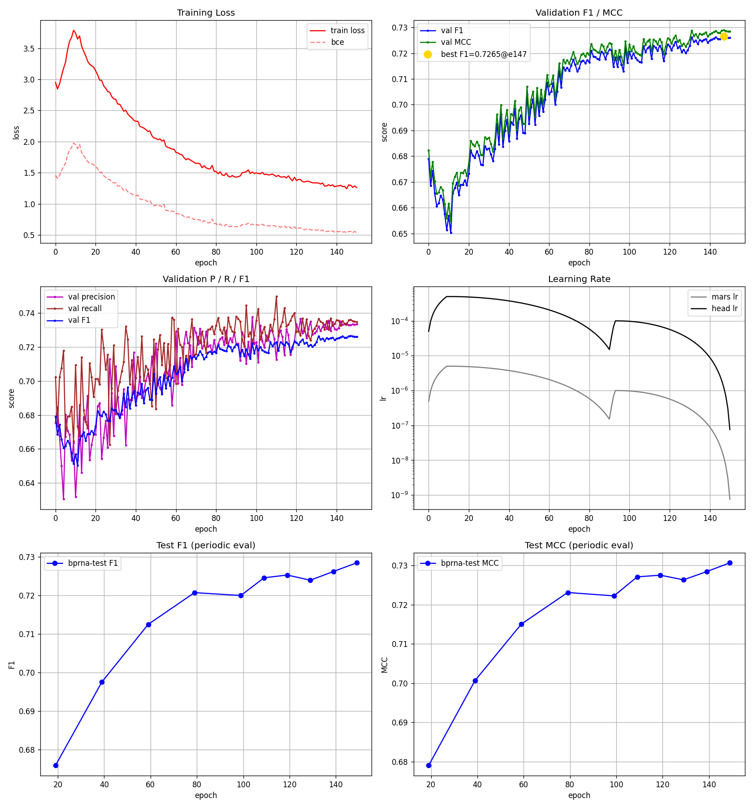
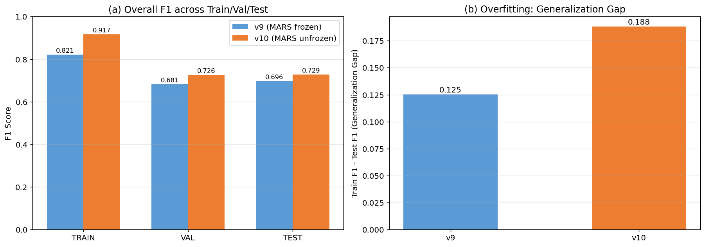
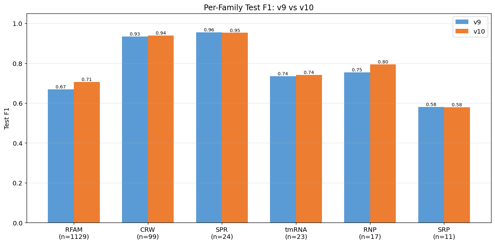
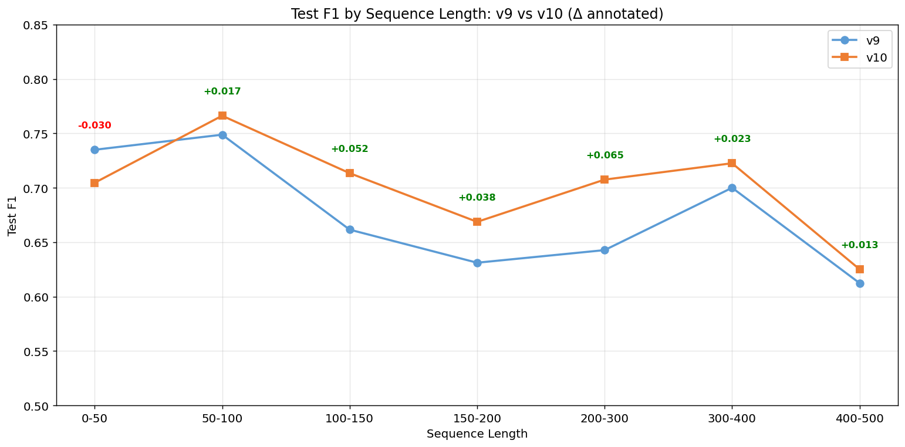
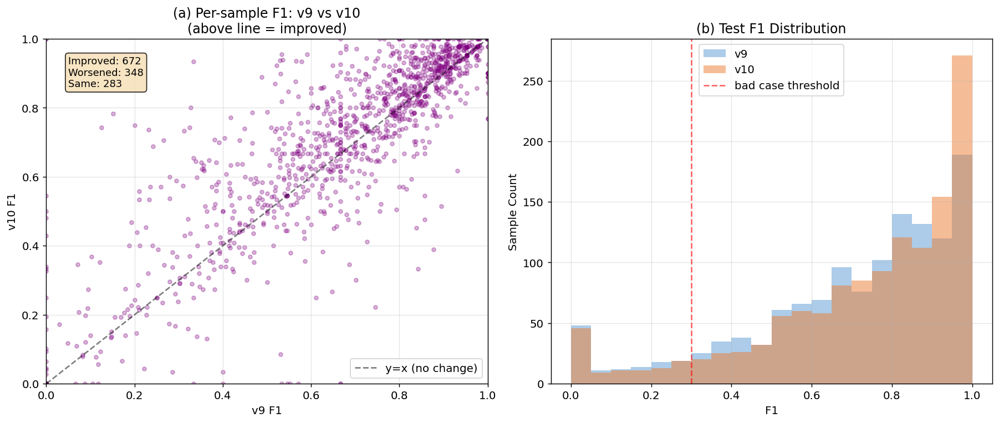
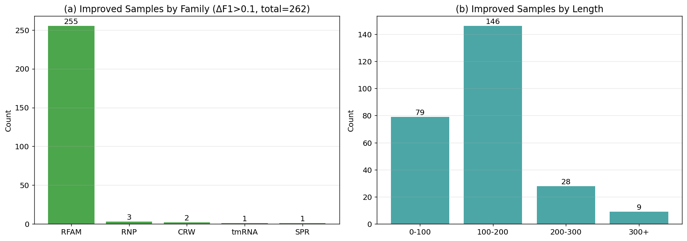
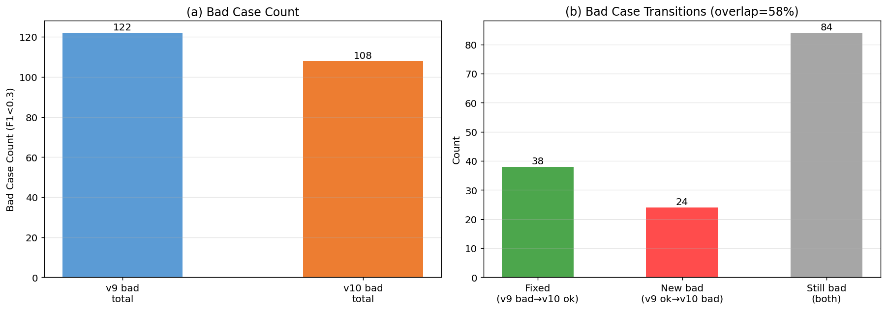

# v10 版本完整报告：MARS 解冻实验

> 汇总报告 | 评估基于 train(10807) + val(1299) + test(1303) **全量数据**
> 对比基准：v9 (MARS frozen) vs v10 (MARS unfrozen)

---

## 1. v10 做了什么改进

v10 的**唯一改动**：将 MARS 预训练语言模型（160M 参数）从**冻结**改为**全部解冻**参与训练。模型架构（DensityNetProPlus）与 v9 完全相同。

| 配置项 | v9 | v10 | 说明 |
|--------|-----|-----|------|
| **freeze_mars** | true | **false** | 核心改动 |
| 可训练参数 | 5.09M | **165.7M** | 增加 33 倍 |
| MARS LR | — | 5e-6 | 极小学习率保护预训练知识 |
| Head LR | 5e-4 | 5e-4 | 不变 |
| 初始化 | 从头训练 | **从 v9 best.pt warm-start** | 站在 v9 肩膀上 |
| grad_clip | 1.0 | **0.5** | 保护 MARS 梯度 |
| 训练轮次 | 183 ep | 151 ep (90 常规+60 精调) | |

### 改进动机

v9 时 MARS 输出固定的"通用 RNA 表征"。解冻后，MARS 的 attention 和 hidden states 可以从"哪些碱基相似"进一步优化为"哪些碱基可能配对"，实现端到端联合优化。

### v10 训练曲线

训练过程分两阶段：前 90 epoch 常规训练（mars_lr=5e-6, head_lr=5e-4），后 60 epoch 小 LR 精调（mars_lr=1e-6, head_lr=1e-4）。Test F1 在精调阶段仍有缓慢提升，最终在 epoch 149 达到 0.7287。

---

## 2. v10 改进后与 v9 的表现比较

### 2.1 总体表现：全面提升，但过拟合加剧

| Split | v9 F1 | v10 F1 | ΔF1 |
|-------|-------|--------|-----|
| Train | 0.8212 | **0.9167** | **+0.0955** |
| Val | 0.6814 | **0.7265** | +0.0451 |
| Test | 0.6961 | **0.7287** | +0.0326 |

**关键发现**：
- ✅ 三个 split 全部提升，Test F1 +3.26pp
- ⚠️ **泛化 gap 从 0.125 扩大到 0.188**：train 提升 (+9.6pp) 远大于 test 提升 (+3.3pp)
- 这是典型的**过拟合加剧**——MARS 解冻让模型记住了更多训练数据，但泛化增益有限

### 2.2 Precision / Recall 同步提升

| Split | v9 Prec | v10 Prec | v9 Rec | v10 Rec |
|-------|---------|----------|--------|---------|
| Test | 0.6917 | **0.7335** | 0.7186 | **0.7386** |

Precision (+4.2pp) 和 Recall (+2.0pp) 都有提升，Precision 提升更明显。

### 2.3 按家族对比：RFAM 和 RNP 受益最大

| 家族 | N | v9 F1 | v10 F1 | ΔF1 | 评价 |
|------|---|-------|--------|-----|------|
| RFAM | 1129 | 0.6691 | 0.7056 | **+0.0365** | ✅ 主力受益（占87%） |
| RNP | 17 | 0.7546 | 0.7951 | **+0.0405** | ✅ 提升最大 |
| tmRNA | 23 | 0.7354 | 0.7420 | +0.0066 | ➖ 微升 |
| CRW | 99 | 0.9346 | 0.9398 | +0.0052 | ➖ 已饱和 |
| SPR | 24 | 0.9560 | 0.9530 | **-0.0030** | ❌ 微降（已饱和） |
| SRP | 11 | 0.5811 | 0.5789 | **-0.0023** | ❌ 微降（最难） |

**结论**：MARS 解冻主要帮助了**主力家族 RFAM**；已经接近饱和的 CRW/SPR 几乎无变化甚至微降；最难的 SRP 仍未解决。

### 2.4 按序列长度对比：中长序列改善最明显

| 长度区间 | N | v9 F1 | v10 F1 | ΔF1 |
|----------|---|-------|--------|-----|
| 0-50 | 29 | 0.7350 | 0.7046 | **-0.0303** ❌ |
| 50-100 | 542 | 0.7488 | 0.7662 | +0.0174 |
| 100-150 | 393 | 0.6616 | 0.7135 | +0.0519 ✅ |
| 150-200 | 139 | 0.6312 | 0.6687 | +0.0376 |
| **200-300** | 97 | 0.6427 | 0.7075 | **+0.0648** ✅ 最大 |
| 300-400 | 76 | 0.7000 | 0.7226 | +0.0225 |
| 400-500 | 27 | 0.6124 | 0.6251 | +0.0127 |

**结论**：
- v10 在 **100-300 nt 中长序列**改善最明显（+5~6.5pp）
- **唯一退化的是 0-50 短序列（-3pp）**——可能 MARS 解冻让模型对简单结构过度复杂化

### 2.5 逐样本分析：672 个改善 vs 348 个退化

- **改善**: 672 个样本 (ΔF1>0.01)
- **退化**: 348 个样本 (ΔF1<-0.01)
- **不变**: 283 个样本
- 净改善 324 个，F1 分布整体右移

### 2.6 改善样本的分布：几乎全是 RFAM 中长序列

262 个显著改善样本 (ΔF1>0.1)：
- **家族**: RFAM=255 (97%), RNP=3, CRW=2, SPR=1, tmRNA=1
- **长度**: 100-200=146 (最多), 0-100=79, 200-300=28, 300+=9

典型大幅改善案例：
| 样本 | 长度 | v9→v10 |
|------|------|--------|
| bpRNA_RFAM_6486 | 56 | 0.00 → **1.00** |
| bpRNA_RFAM_6042 | 96 | 0.00 → **1.00** |
| bpRNA_RFAM_12790 | 223 | 0.15 → **0.78** |

### 2.7 Bad Case 分析：不是同一批！

| 类别 | 数量 |
|------|------|
| v9 bad cases (F1<0.3) | 122 |
| v10 bad cases | 108 |
| ✅ 修复 (v9 bad→v10 好) | **38** |
| ❌ 新增 (v9 好→v10 bad) | **24** |
| ⚠️ 两版本都 bad | 84 |
| **重合率** | **57.5%** |

**重要洞察**：v10 的 bad case 与 v9 **重合率仅 57.5%**！净减少 14 个是"修复 38、搞坏 24"的结果。这说明 MARS 解冻**改变了模型的错误模式**——不是单纯变强，而是**能力的重新分布**。

新产生的退化案例（如 `bpRNA_RFAM_6374` 从 0.67→0, `bpRNA_RFAM_25434` 从 0.67→0）值得警惕，多为短/中长 RFAM 序列。

---

## 3. 总结与下一步计划

### 3.1 放开 MARS 权重的影响总结

| 维度 | 结论 |
|------|------|
| ✅ Test F1 | +3.26pp (0.6961→0.7287)，确实有效 |
| ✅ Precision/Recall | 同步提升 (+4.2pp / +2.0pp) |
| ✅ 主要受益者 | RFAM（87%样本）、RNP、100-300nt 中长序列 |
| ⚠️ 过拟合加剧 | Gap 从 0.125 → 0.188 |
| ⚠️ 错误模式改变 | Bad case 重合率仅 57.5%，修复38+新增24 |
| ❌ 短序列退化 | 0-50nt 区间 -3pp |
| ❌ 难点未解 | SRP 家族、84 个顽固 bad case 两版本都失败 |

### 3.2 核心诊断

1. **MARS 解冻是有效的，但收益主要来自"记住训练分布"**，泛化提升受限于过拟合
2. **84 个顽固 bad case** 两版本都解决不了，是真正的能力瓶颈（GT 配对概率极低，模型完全不认识这些结构）
3. **错误模式的重分布**说明模型容量提升带来的是"换了一批会做/不会做的题"，而非整体能力跃升

### 3.3 下一步计划

**方向 A：抑制过拟合（针对 gap=0.188）**
- ⬜ 增大 dropout (0.2→0.3) / drop_path (0.15→0.25)
- ⬜ 数据增强加强（非配对位随机突变、子结构 dropout）
- ⬜ Label smoothing
- 已尝试: v11a hard-case 过采样（效果边际，见 v11a 报告）

**方向 B：攻克顽固 bad case（84 个两版本都失败）**
- ⬜ 这些 case GT 配对概率仅 0.20，需要**提升特征表达力**而非数据增强
- ⬜ 考虑增大 hidden_dim 或引入更强的 2D 交互建模

**方向 C：探索生成式范式（v11b）**
- 🏃 Flow Matching + DiT，期望通过迭代采样获得不同的错误模式，与判别式互补

**方向 D：短序列退化修复**
- ⬜ 调查 0-50nt 退化原因，可能需要长度自适应的解码策略

---

> 附：所有图表源数据见 `symfold/outputs/v9_v10_compare/`，绘图脚本 `symfold/eval/plot_v9_v10.py`
