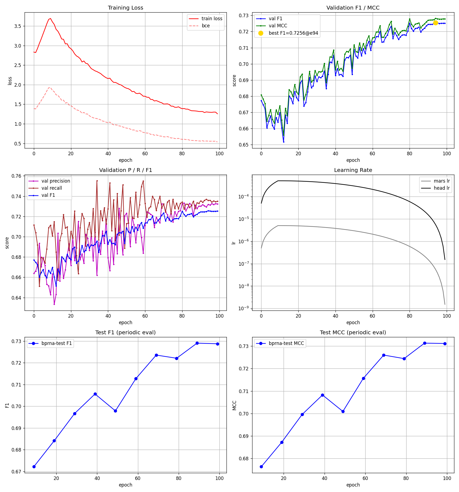
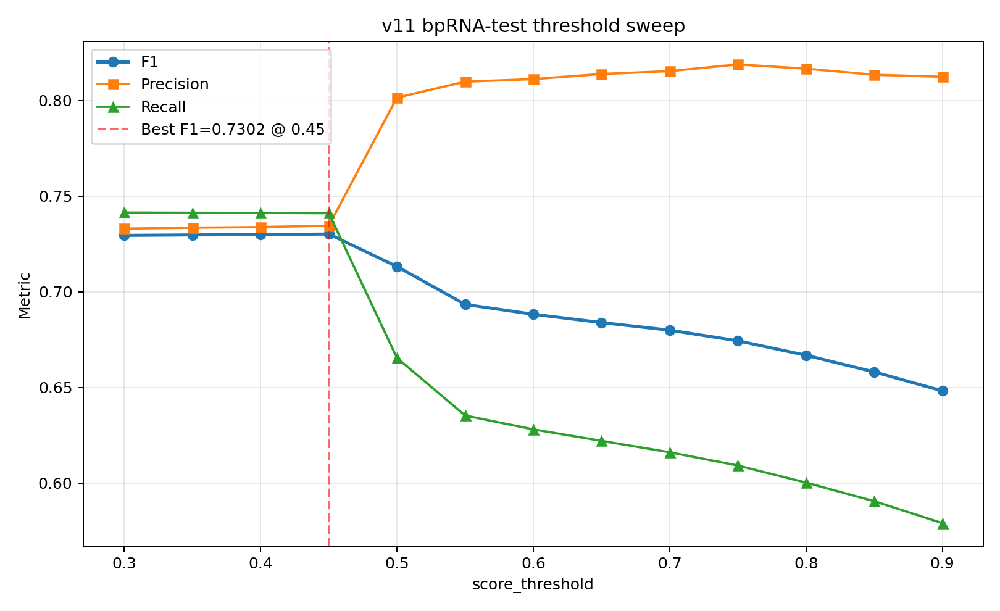

# 对Bad Case过采样实验 与 阈值调整


## 总结

对之前版本的Bad Case，设计了一套计算RNA之间相似度的公式，对训练集中与Bad Case相似的样本进行过采样，以提升模型性能。但训练结果表明，过采样对模型表现的影响不大。此外，我猜想调整阈值有可能对模型的性能有所改进，因此通过调整阈值观察模型在不同阈值下的表现，最终发现，模型在配对概率阈值为0.45时表现最佳。 但是这种改进不足以让模型SOTA。下一步工作考虑再阅读一些RNA二级结构预测的经典论文，以及学习一些深度学习中关于采样 / 过拟合的相关基础知识，而不是盲目开展实验。


## 过采样设计

从之前版本的模型评估结果中筛选出 F1 < 0.3的 bad case，共计108条：

```python
bad_cases = [s for s in test_results if s['f1'] < 0.3]
```

随后统计这些 bad cases 的结构特征：包括序列长度，配对数，平均配对距离，家族等。

| 特征 | 含义 | 后续是否用于相似度 |
|---|---|---|
| `length` | 序列长度 | 是 |
| `n_pairs` | GT 配对数 | 是 |
| `mean_distance` | 平均配对距离，即平均 `j-i` | 是 |
| `family` | 从 `file_name` 中解析出的家族名 | 是 |


对每个 v10 test bad case 和每个 train 样本，计算：

- 长度相似度

$$
[
len\_sim = 1 - \frac{|L_{train} - L_{bad}|}{\max(L_{train}, L_{bad}, 1)}
]
$$

- 配对数量相似度

$$
[
pair\_sim = 1 - \frac{|P_{train} - P_{bad}|}{\max(P_{train}, P_{bad}, 1)}
]
$$

- 平均配对距离相似度
$$
[
dist\_sim = 1 - \frac{|D_{train} - D_{bad}|}{\max(D_{train}, D_{bad}, 1)}
]
$$

在 train 中找与这些 test bad cases “结构统计相似”的样本，对这些 train 样本做 `2x` 过采样。
```json
"hardcase_oversample": {
  "enabled": true,
  "oversample_factor": 2,
  "similarity_threshold": 0.80,
}
```


最终过采样共 4494 个样本。

## 训练情况


训练曲线：



综合表现对比


| 指标 | v10 | v11 | Δ |
|---|---:|---:|---:|
| Mean F1 | 0.7287 | 0.7301 | +0.0013 |
| Median F1 | 0.8000 | 0.8065 | +0.0065 |
| Mean Precision | 0.7335 | 0.7342 | +0.0007 |
| Mean Recall | 0.7386 | 0.7412 | +0.0026 |
| Mean MCC | 0.7310 | 0.7324 | +0.0015 |
| Bad cases `F1<0.3` | 108 / 1303 | 105 / 1303 | -3 |
| Medium-bad `0.3≤F1<0.5` | 104 | 120 | +16 |

结论：基本没什么收益。

---

## Bad Case 变化


| 类别 | 数量 | 占比/说明 |
|---|---:|---|
| 修复：bad →  非 bad | 17 | 15.7% |
| 仍然 bad | 91 | 84.3% |
| 新增 bad | 14 | 副作用 |

### 修复样本示例

| 样本 | 家族 | 长度 | v10 F1 | v11 F1 | ΔF1 |
|---|---|---:|---:|---:|---:|
| `bpRNA_RFAM_6040` | RFAM | 151 | 0.0000 | 0.5000 | +0.5000 |
| `bpRNA_RFAM_25434` | RFAM | 37 | 0.0000 | 0.4615 | +0.4615 |
| `bpRNA_RFAM_25088` | RFAM | 69 | 0.0000 | 0.4545 | +0.4545 |
| `bpRNA_RFAM_6374` | RFAM | 71 | 0.0000 | 0.4000 | +0.4000 |
| `bpRNA_RFAM_9749` | RFAM | 101 | 0.0851 | 0.4706 | +0.3855 |

### 新增 bad case 示例

| 样本 | 家族 | 长度 | v10 F1 | v11 F1 | ΔF1 |
|---|---|---:|---:|---:|---:|
| `bpRNA_RFAM_16359` | RFAM | 72 | 0.5000 | 0.0000 | -0.5000 |
| `bpRNA_RFAM_4349` | RFAM | 207 | 0.5823 | 0.2029 | -0.3794 |
| `bpRNA_RFAM_15770` | RFAM | 93 | 0.6000 | 0.2353 | -0.3647 |
| `bpRNA_RFAM_14719` | RFAM | 74 | 0.5455 | 0.1818 | -0.3636 |
| `bpRNA_RFAM_11730` | RFAM | 125 | 0.5000 | 0.1429 | -0.3571 |

### Bad Case按照家族的变化

| 家族 | 样本数 | v10 Mean F1 | v11 Mean F1 | ΔF1 | v10 Bad | v11 Bad | ΔBad |
|---|---:|---:|---:|---:|---:|---:|---:|
| SRP | 11 | 0.5789 | 0.5958 | +0.0169 | 2 | 1 | -1 |
| RFAM | 1129 | 0.7056 | 0.7074 | +0.0018 | 105 | 103 | -2 |
| tmRNA | 23 | 0.7420 | 0.7509 | +0.0088 | 0 | 0 | 0 |
| RNP | 17 | 0.7951 | 0.7848 | -0.0103 | 0 | 0 | 0 |
| CRW | 99 | 0.9398 | 0.9392 | -0.0007 | 1 | 1 | 0 |
| SPR | 24 | 0.9530 | 0.9358 | -0.0172 | 0 | 0 | 0 |

### Bad Case按照长度的变化

| 长度区间 | 样本数 | v10 Mean F1 | v11 Mean F1 | ΔF1 | v10 Bad | v11 Bad | ΔBad |
|---|---:|---:|---:|---:|---:|---:|---:|
| 0-50 | 29 | 0.7046 | 0.6881 | -0.0166 | 5 | 4 | -1 |
| 50-100 | 542 | 0.7662 | 0.7700 | +0.0037 | 39 | 39 | 0 |
| 100-200 | 532 | 0.7018 | 0.7029 | +0.0011 | 49 | 48 | -1 |
| 200-300 | 97 | 0.7075 | 0.6979 | -0.0097 | 7 | 7 | 0 |
| 300-490 | 103 | 0.6970 | 0.7026 | +0.0056 | 8 | 7 | -1 |


总结： 降低Bad Case数量的同时，又引入了新的Bad Case，整体表现一般。

---

## 调整阈值看能否带来收益

我们的Concat Map是通过一个阈值给出的，大于该阈值的位置预测为1，小于该阈值的位置预测为0。考虑能不能调整阈值来让模型在推理时能够提升性能。

阈值曲线：




| threshold | F1 | Precision | Recall | MCC | pred_pairs | gt_pairs | pred/gt |
|---:|---:|---:|---:|---:|---:|---:|---:|
| 0.30 | 0.729486 | 0.733018 | 0.741422 | 0.731899 | 30.124 | 31.094 | 0.969 |
| 0.35 | 0.729737 | 0.733521 | 0.741313 | 0.732124 | 30.117 | 31.094 | 0.969 |
| 0.40 | 0.729868 | 0.733849 | 0.741236 | 0.732256 | 30.109 | 31.094 | 0.968 |
| 0.45 | **0.730199** | **0.734562** | 0.741104 | **0.732570** | 30.089 | 31.094 | 0.968 |
| 0.50 | 0.713226 | 0.801515 | 0.665403 | 0.721614 | 24.732 | 31.094 | 0.795 |
| 0.55 | 0.693411 | 0.809834 | 0.635344 | 0.705849 | 22.799 | 31.094 | 0.733 |
| 0.60 | 0.688261 | 0.811185 | 0.628071 | 0.701724 | 22.398 | 31.094 | 0.720 |
| 0.65 | 0.683921 | 0.813861 | 0.622079 | 0.698460 | 22.068 | 31.094 | 0.710 |
| 0.70 | 0.679942 | 0.815381 | 0.616117 | 0.695312 | 21.732 | 31.094 | 0.699 |
| 0.75 | 0.674393 | 0.818865 | 0.609194 | 0.691184 | 21.351 | 31.094 | 0.687 |
| 0.80 | 0.666823 | 0.816669 | 0.600258 | 0.684431 | 20.947 | 31.094 | 0.674 |
| 0.85 | 0.658116 | 0.813458 | 0.590538 | 0.676693 | 20.498 | 31.094 | 0.659 |
| 0.90 | 0.648200 | 0.812423 | 0.579062 | 0.668017 | 19.967 | 31.094 | 0.642 |

总结：

1. `0.30 ~ 0.45` 区间非常平，F1 都在 `0.7295 ~ 0.7302`。
2. 最优点是 `0.45`，相比 `0.30` 提升约 `+0.0007`，属于小幅调优收益。
3. 高阈值提升 precision，但 recall 大幅下降：
   - `0.45`: Precision `0.7346`，Recall `0.7411`
   - `0.50`: Precision `0.8015`，Recall `0.6654`
4. 很多正确配对 score 分布在 `0.45 ~ 0.50` 附近；阈值过高会直接漏掉大量 GT 配对。
---

## 总体结论与下一步工作

对Bad Case进行过采样的收益十分有限，可能有这几个原因：

1. 过采样计算相似度反应的是RNA序列之间统计数据的相似性（长度 / 配对密度 / 配对距离），而不是他们在二维结构上的相似性，所以反映到训练过程并不明显，并没有达到我们直接补强数据的目标。
2. 很有可能我们的Bad Case的配对特性没有在训练数据中得到充分表达，所以过采样并没有带来明显的提升。


下一步工作考虑再读几篇最近的论文，反思一下：
MetaFold-RNA：25年9月：用元学习（Meta-Learning）做二级结构预测
https://www.biorxiv.org/content/10.1101/2025.09.18.676970v1

RiNALMo: 是迄今为止最大的 RNA 语言模型，拥有 6.5 亿个参数，并在来自多个数据库的 3600 万条非编码 RNA 序列上进行了预训练。它能够提取隐藏知识，并捕捉 RNA 序列中隐含的结构信息。
https://www.nature.com/articles/s41467-025-60872-5


---

