# PriFold v7 DensityNet: 全面推理分析报告

> 模型：v7_full best.pt (200 epochs, best val F1=0.6408, test F1=0.6538)

> 数据集：bpRNA train(10807)/val(1299)/test(1303)

---

总结：为了能够更加深入地了解模型的性能，我们对模型在bpRNA train/val/test上的表现进行了更全面的分析。分析想要回答以下问题：

- Bad case与序列长度是否有关
- Bad case与

配对距离是否有关系 序列长度 结构复杂度 伪结和配对情况之间的关系

## 总体表现

| 指标 | Train | Val | Test |
|------|-------|-----|------|
| F1 | 0.9093 | 0.6413 | 0.6546 |
| PRECISION | 0.8778 | 0.6163 | 0.6267 |
| RECALL | 0.9527 | 0.6907 | 0.7035 |
| MCC | 0.9117 | 0.6454 | 0.6579 |
| N | 10807 | 1299 | 1303 |
| F1=0 | 1 (0.0%) | 42 (3.2%) | 39 (3.0%) |
| F1<0.3 | 2 (0.0%) | 186 (14.3%) | 163 (12.5%) |
| pred/gt ratio | 1.106 | 1.231 | 1.261 |

## F1 与序列长度的关系

我们首先统计了在所有数据（train/val/test）上，F1与RNA序列长度之间的关系，并绘制图表。
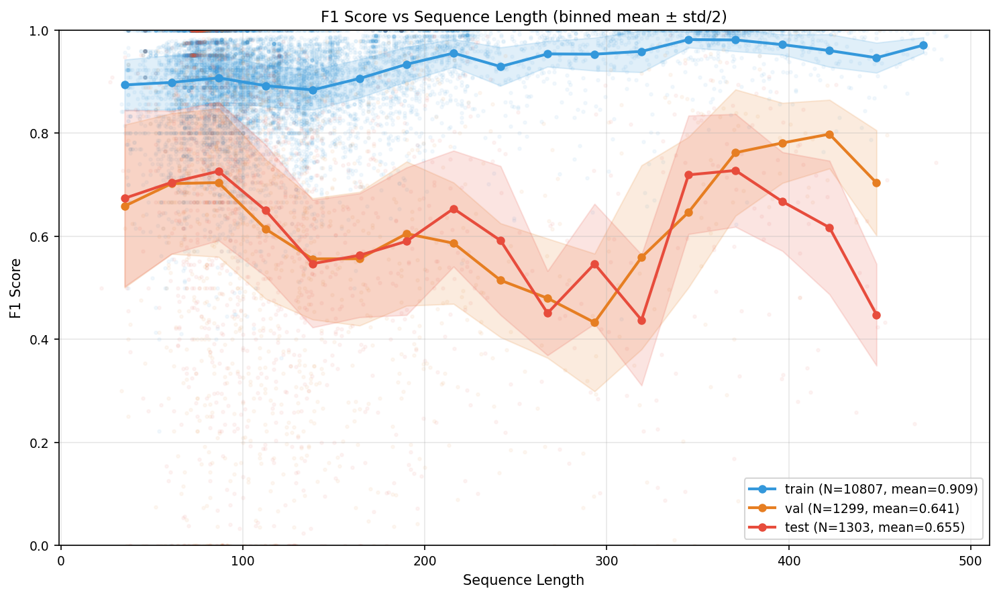

**关键观察**：
- **Train（蓝）**：全长度范围 F1 > 0.85，长度 200+ 仍保持 ~0.90
- **Val/Test（橙/红）**：长度 > 150 后 F1 明显下降（从 ~0.70 降到 ~0.55）
- **泛化 gap 随长度增大**：短序列（<100）gap ~15%，长序列（300+）gap ~35%

**结论**：在训练集上，模型表现与RNA序列长度关系不大。但是在测试集和验证集上， Length = 300附近｜Length = 400 + 附近，模型有比较明显的泛化性能下降。（从0.6 f1 score 跌至 0.4 f1 score）。序列长度确实对模型泛化性能有影响。

随后，我们想要分析一下，模型的Bad case与序列长度是否有关（Bad case是否集中在某个长度区间），绘制了Bad case数量与RNA序列长度的图像。
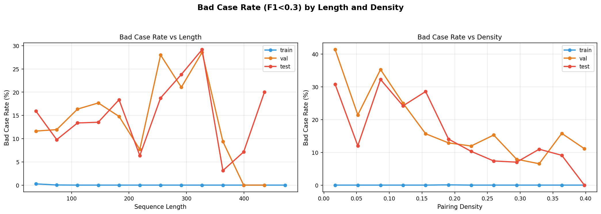

**关键观察**：
- Train 上 bad case rate 几乎为 0（模型完全能学会train set）
- Val/Test 上：长度 > 200 后 bad case rate 快速升到 20-30%

**结论**：长度在200-400的RNA序列构成了主要的Bad case。

---

## F1 与配对密度的关系

下图是F1在 train/val/test 上随样本配对密度的变化图。
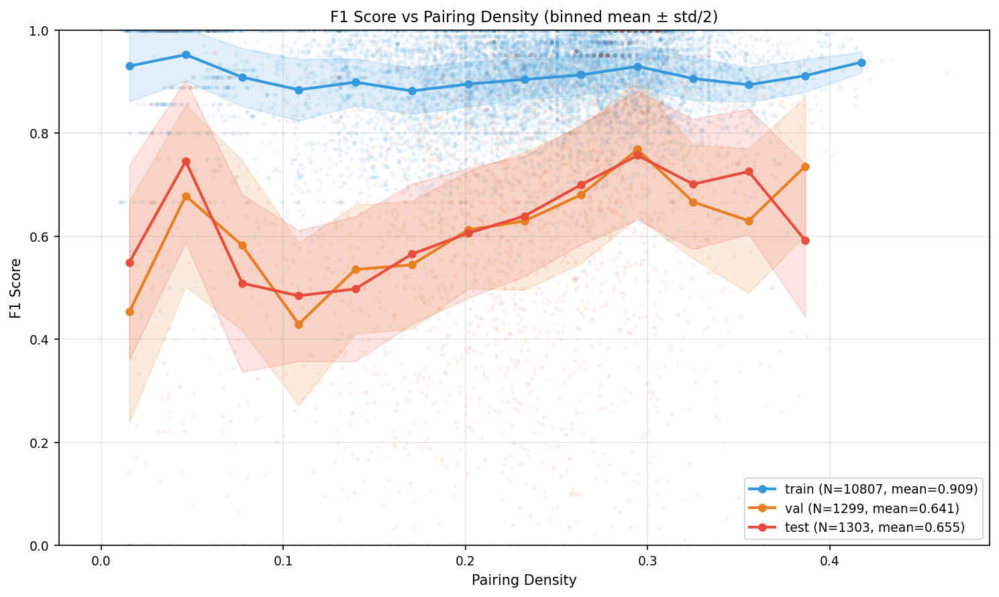

**关键观察**：
- **低密度（<0.15）是灾难区**：Val/Test F1 仅 ~0.40-0.50
- **中等密度（0.20-0.30）**：Val/Test F1 在 ~0.65-0.70
- **高密度（>0.30）**：Val/Test F1 可达 ~0.75-0.80
- Train 在所有密度上都 > 0.85

**结论**：配对密度在0.1左右的样本比较难学习，配对密度较高的样本反而F1更高。

此外，我们又分析了多项指标与配对密度之间的关系( precision / recall / (pred/gt))。 如下图所示。
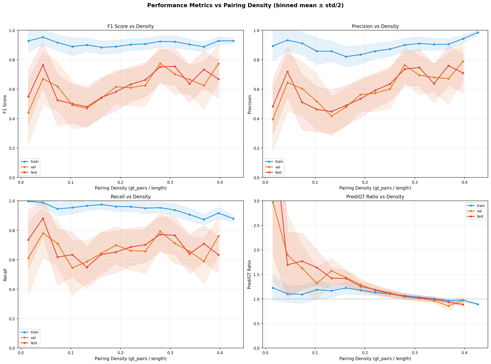

**关键观察**：
- 低密度时 pred/gt ratio 极高（>2.0）→ 严重过预测
- 高密度时 pred/gt ≈ 1.0 → 预测数量准确

**结论**：模型在低配对密度的样本上，很容易过预测。

---

## F1 与伪结的关系

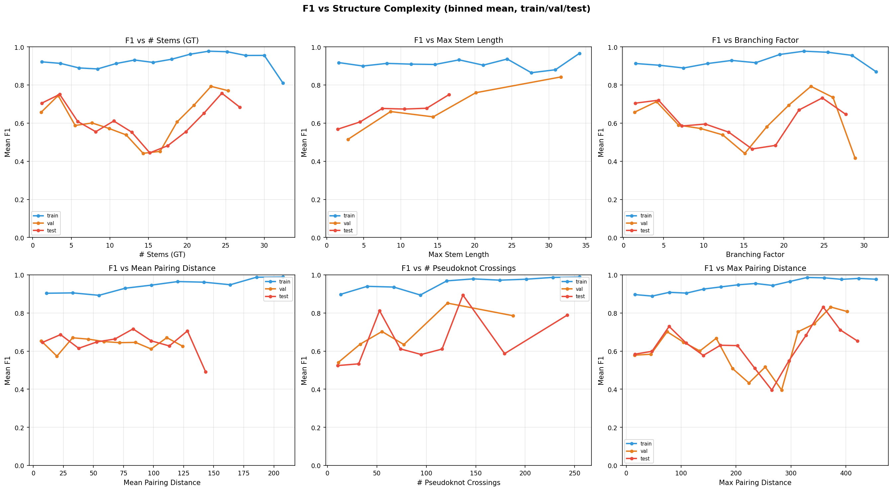

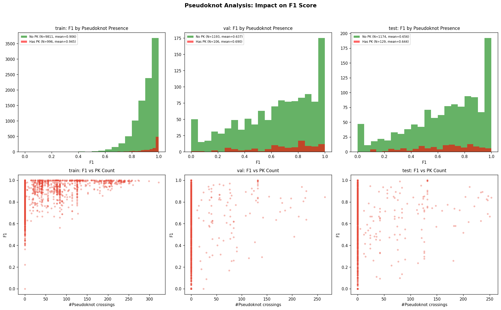

| 指标 | Train | Val | Test |
|------|-------|-----|------|
| 有伪结样本占比 | 9.2% | 8.2% | 9.9% |
| 有伪结样本平均 F1 | 0.9452 | 0.6898 | 0.6443 |
| 无伪结样本平均 F1 | 0.9056 | 0.6370 | 0.6557 |
| 伪结导致的 F1 下降 | -0.0396 | -0.0528 | +0.0114 |

**结论**：伪结数=15时，模型在测试集和验证集上表现最差。伪结对 Val 有负面影响（-5.3%），但 Test 上几乎无影响。伪结不是主要失败原因。

---

## 6.1 按长度/密度的绘制泛化 Gap图

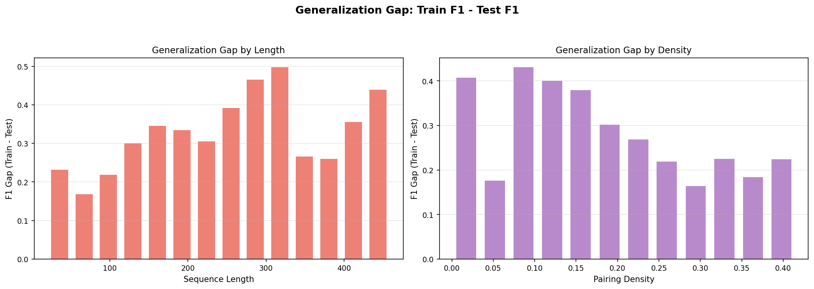

**关键观察**：
- **长度维度**：gap 在 200-400 区间最大（~30%），短序列 gap 较小
- **密度维度**：低密度 gap ~35%，高密度 gap ~20%

**结论**：长序列 + 低密度 = 泛化最差的区域

---

## 配对距离分布分析

---

## 9. Bad Case 全面分析

### 失败模式分类

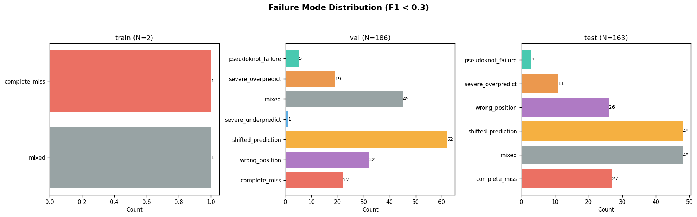

**VAL** (N=186):

| 模式 | 数量 | 占比 | 说明 |
|------|------|------|------|
| shifted_prediction | 62 | 33.3% | 预测偏移（>30% FP 在 GT ±3 范围内） |
| mixed | 45 | 24.2% | 混合/其他 |
| wrong_position | 32 | 17.2% | 数量对位置错（pred/gt≈1 但 F1<0.3） |
| complete_miss | 22 | 11.8% | 完全预测错误（TP=0，无近似对） |
| severe_overpredict | 19 | 10.2% | 严重过预测（pred/gt > 2） |
| pseudoknot_failure | 5 | 2.7% | 伪结导致失败 |

**TEST** (N=163):

| 模式 | 数量 | 占比 | 说明 |
|------|------|------|------|
| mixed | 48 | 29.4% | 混合/其他 |
| shifted_prediction | 48 | 29.4% | 预测偏移 |
| complete_miss | 27 | 16.6% | 完全预测错误 |
| wrong_position | 26 | 16.0% | 数量对位置错 |
| severe_overpredict | 11 | 6.7% | 严重过预测 |
| pseudoknot_failure | 3 | 1.8% | 伪结导致失败 |

**结论**：无论是 VAL 还是 TEST，预测的偏移都是Bad Case出现的主要模式。

---

## 10. 成功 vs 失败案例对比

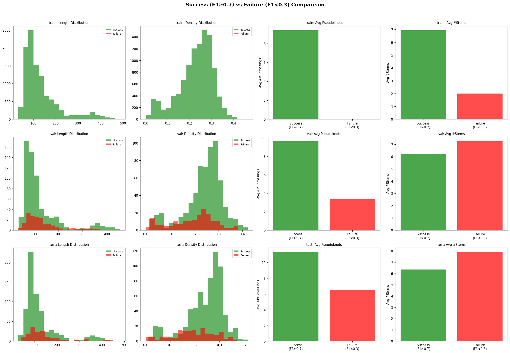

### 10.2 同长度下 Contact Map 对比

**Test 集，长度 100-200：**

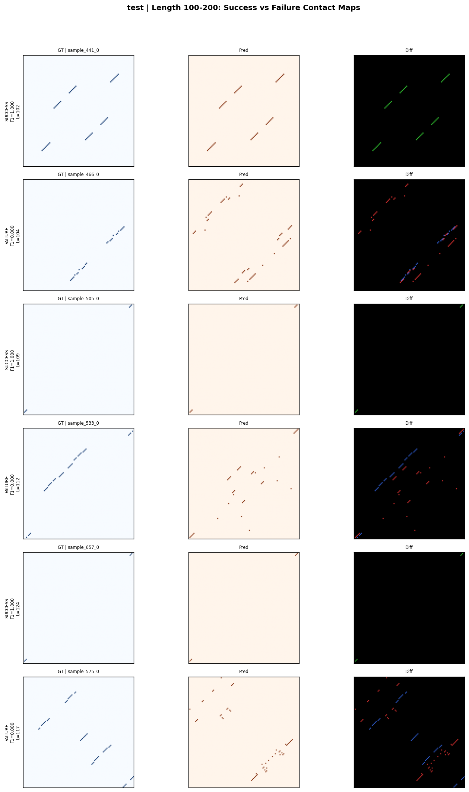

**Test 集，长度 200-300：**

**Test 集，长度 300+：**

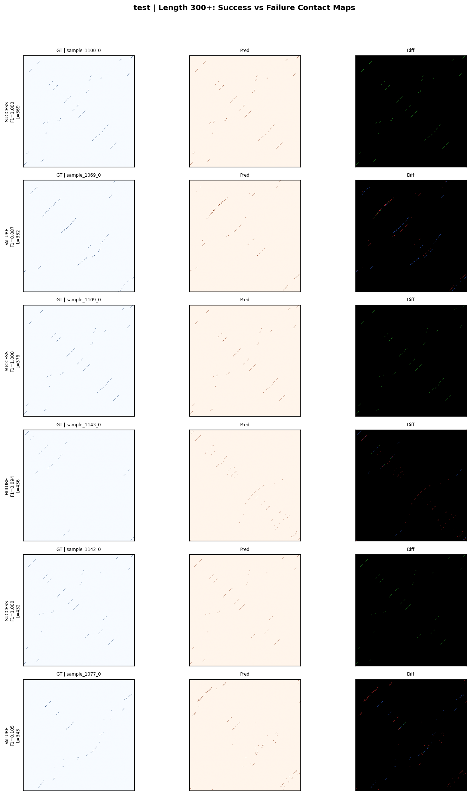

---

## 11. 深度原因分析

### 11.1 核心问题总结

| 问题 | 数据支撑 | 严重度 |
|------|----------|--------|
| **泛化 gap 极大** | Train F1=0.909 vs Test F1=0.655（-25.4%），长序列 gap 达 35% | ★★★★★ |
| **Precision 随长度崩塌** | Test P 从短序列 0.70 降到长序列 0.50 | ★★★★★ |
| **低密度过预测** | density<0.15 时 pred/gt>2.0, F1~0.40 | ★★★★ |
| **预测偏移** | 33% bad cases 是 shifted_prediction | ★★★★ |
| **数量对位置错** | 17% bad cases 预测对数对但位置完全错 | ★★★ |
| **长距离配对难** | max_dist>150 的样本 F1 极低 | ★★★ |

### 11.2 失败根因分析

#### A. 为什么长序列 Precision 崩塌？

从 `metrics_vs_length.png` 可以明确看到：
1. **搜索空间 O(L²) 增长**：长度 300 的序列有 ~45000 个候选位置，长度 100 的只有 ~5000 个
2. **pred/gt ratio 随长度单调增加**：模型在长序列上系统性过预测
3. **density budget 不够精确**：budget_fraction=0.30 对长序列估计偏高
4. → **改进**：使长度感知的 budget 调整，或引入长度惩罚项

#### B. 为什么低密度样本过预测严重？

从 `metrics_vs_density.png` 和 `density_length_interaction.png` 可以看到：
1. **密度预测 head 对低密度估计偏高**：实际 density=0.10 时模型估计 ~0.20
2. **DST loss 的 threshold=0.18 可能不够低**：还需覆盖 density<0.10 的样本
3. → **改进**：降低 DST threshold 到 0.10，或对极低密度区间使用更激进的 FN 权重

#### C. 为什么 shifted_prediction 是最大失败模式？

1. Loss 对 "偏移 1 位" 和 "完全错" 的惩罚相同（BCE per-position, 无结构感知）
2. Axial Transformer 的 row/col attention 是局部的，容易产生 ±1 位移
3. → **改进**：引入 margin loss 或 soft-matching 的 partial credit

#### D. 泛化 gap 根因

从 `generalization_gap.png` 可以看到：
1. Gap 在所有长度/密度上都存在，说明是系统性问题
2. 3.56M 参数 + 10807 训练样本 → 模型有能力"记住"训练集
3. → **改进**：更强数据增强 + Dropout 增大 + Family balanced sampling

### 11.3 改进建议（按优先级排序）

| 优先级 | 方案 | 目标问题 | 具体做法 | 预期改善 |
|--------|------|----------|----------|----------|
| P0 | **OHEM** | FP 稀释 | top-k hardest negatives 计算 neg_bce | Precision +3-5% |
| P0 | **FP Penalty** | 过预测 | 对 FP 位置施加 3x 额外权重 | pred/gt → ~1.0 |
| P1 | **长度感知 Budget** | 长序列过预测 | budget_fraction 随 L 衰减：0.30×(100/L)^0.3 | 长序列 P +5% |
| P1 | **BP Compatibility** | 非法配对 | 过滤非 AU/GC/GU 配对 | Precision +1-2% |
| P1 | **Shift-aware Loss** | 偏移预测 | GT ±1 范围内给 partial credit | 减少 shifted |
| P2 | **DST threshold 降低** | 低密度 | threshold 从 0.18 降到 0.10 | 低密度 F1 +5% |
| P2 | **Family Balanced** | 泛化 | 按家族逆频率过采样 | 减少 complete_miss |
| P3 | **更大模型** | 泛化能力 | hidden_dim=256, layers=12 | 整体 +2-3% |
| P3 | **Dropout 增大** | 过拟合 | dropout 0.1→0.2 | 缩小 gap |

---

## 12. 碱基配对合法性分析 (Canonical vs Non-canonical)

### 12.1 全数据集 Ground Truth 统计

| 指标 | Train (N=10807) | Val (N=1299) | Test (N=1303) |
|------|-----------------|--------------|---------------|
| Total pairs | 331,361 | 39,253 | 40,515 |
| **Canonical (AU/GC/GU)** | 297,167 (**89.7%**) | 35,166 (**89.6%**) | 36,441 (**89.9%**) |
| **Non-canonical** | 34,194 (**10.3%**) | 4,087 (**10.4%**) | 4,074 (**10.1%**) |
| 含 NC 的样本比例 | 7,826/10,807 (**72.4%**) | 938/1,299 (**72.2%**) | 946/1,303 (**72.6%**) |

**Non-canonical 类型 TOP-8（Train）**:

| 类型 | 数量 | 占 NC 比例 |
|------|------|-----------|
| U-U | 4,492 | 13.1% |
| G-G | 3,741 | 10.9% |
| A-C | 3,712 | 10.9% |
| C-A | 3,608 | 10.6% |
| G-A | 3,582 | 10.5% |
| A-G | 3,364 | 9.8% |
| C-U | 3,194 | 9.3% |
| U-C | 2,934 | 8.6% |

### 12.2 Bad Cases (F1<0.3) 中的配对合法性

| 指标 | GT | Predicted | FP (预测错) | FN (漏掉) |
|------|-----|-----------|------------|-----------|
| Total | 9,759 | 12,333 | 10,548 | 7,974 |
| Canonical | 7,490 (76.7%) | 11,605 (94.1%) | 9,877 (93.6%) | 5,762 (72.3%) |
| Non-canonical | 2,269 (23.3%) | 728 (5.9%) | 671 (6.4%) | 2,212 (27.7%) |

### 12.3 关键结论

1. **bpRNA 数据集中约 10% 的配对是非标准的**（U-U, G-G, A-C 等），72% 的样本至少含有一个非标准配对
2. **Bad cases 中 GT 的非标准配对高达 23%**（远高于全局 10%）→ 非标准配对多的样本更容易失败
3. **模型几乎不预测非标准配对**（仅 5.9%）→ 因此漏掉了大量 GT 中的非标准配对（FN 中 27.7% 是 NC）
4. **FP 中 93.6% 是 canonical**→ 模型预测错的位置大多是合法碱基组合，问题是位置不对而非配对规则不对
5. **v8 的 BP Compatibility 约束需要谨慎使用**：如果严格过滤非标准配对，会增加 ~10% 的 FN。建议：
   - 训练时 `bp_compat_weight` 设低（0.1-0.2），只做轻微引导
   - 推理时 **不过滤** 非标准配对（`bp_compat_in_inference: false`）
   - 或者只过滤极罕见的非标准配对（如 A-A, C-C），保留 G-A, U-U 等常见 NC

---

## 13. 可视化文件完整索引

### 趋势关系图（新增）

| 文件 | 说明 |
|------|------|
| `f1_vs_length_trend.png` | ★ F1 vs 长度趋势曲线（train/val/test 三线） |
| `f1_vs_density_trend.png` | ★ F1 vs 密度趋势曲线 |
| `metrics_vs_length.png` | ★ F1/P/R/pred_gt 四指标 vs 长度 |
| `metrics_vs_density.png` | ★ F1/P/R/pred_gt 四指标 vs 密度 |
| `f1_vs_complexity_trends.png` | ★ F1 vs 6种复杂度指标趋势 |
| `density_length_interaction.png` | ★ 不同密度区间下 F1 vs 长度（交互效应） |
| `generalization_gap.png` | ★ 泛化 gap 按长度/密度分解 |
| `bad_case_rate.png` | ★ Bad case 比例 vs 长度/密度 |

### 分布与对比图

| 文件 | 说明 |
|------|------|
| `f1_distribution.png` | F1 分布直方图 (train/val/test) |
| `bad_case_distributions.png` | Bad case 多维度分布 |
| `success_vs_failure_comparison.png` | 成功 vs 失败案例特征对比 |
| `pairing_distance_distributions.png` | 配对距离分布（好 vs 坏） |
| `pseudoknot_analysis.png` | 伪结对 F1 的影响 |
| `complexity_vs_f1.png` | 复杂度 vs F1 散点图 |
| `failure_mode_summary.png` | 失败模式分类统计 |
| `f1_heatmap_length_density.png` | F1 热力图（长度×密度） |
| `length_distribution_bad.png` | Bad case 长度分布 |
| `paired_comparison_*.png` | 同长度下成功/失败 contact map 对比（9张） |

### Bad Case 卡片

| 文件 | 说明 |
|------|------|
| `bad_cases/` | 100 张详细卡片，每张含 GT/Pred/Diff + 标注信息 |

### 数据文件

| 文件 | 说明 |
|------|------|
| `all_samples_metrics.csv` | 13409 样本逐条指标（2.4MB） |
| `summary.json` | 核心汇总指标 |

会有很多badcase是这种情况 

还有一些发现就是有的样本本身的Ground Truth就是没有配对

