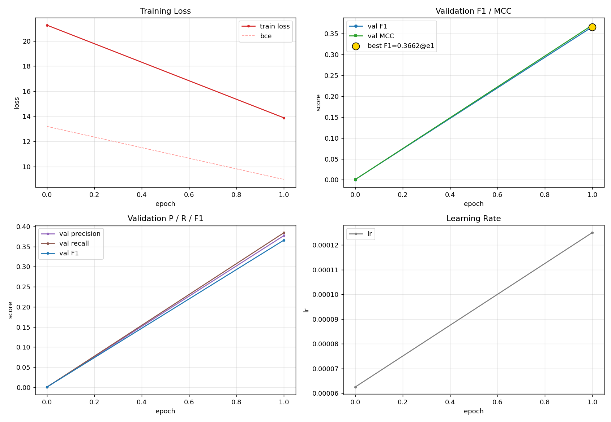
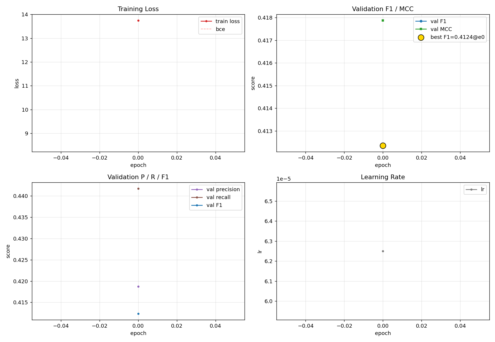
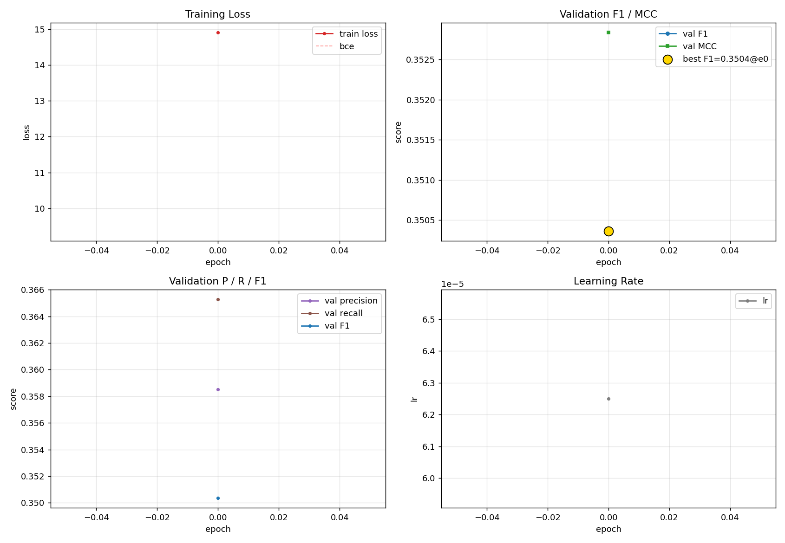

# SymFold 实验总结

---

总结：之前提到数据过拟合以及位置编码相关的猜想。在本实验中，我们尝试增加 2D RoPE位置编码，并对数据进行正则化（设置dropout）以缓解过拟合问题。经过全量实验以及2个消融实验，证明了2D位置编码的有效性，以及Dropout效果不是很明显。在本实验中，模型在测试集上的表现达到0.6919，超过此前的实验，且与baseline仅相差0.07。

后续考虑优化RNA基础模型，把RNA基础模型的权重放开，一起微调，使模型更加适合RNA二级结构预测人物。


---

[TOC]
## 一、核心改进与效果

### 1.1 相比之前版本的关键改进

| # | 改进项 | v8 | v9 | 说明 |
|---|--------|----|----|------|
| P3 | 增强正则化 | dropout=0.1, drop_path=0.05 | dropout=0.2, drop_path=0.15 | 缓解过拟合 |
| P5 | **2D RoPE** | 无位置编码 | 2D 旋转位置编码 | **最关键改进**，编码残基对的相对距离 |

### 1.2 模型架构

```
RNA seq → MARS-LX (frozen, 160M, dim=1056)
        → 1D Projection (1056→192→96) + 2D Attention (72→48→48)
        → Pair Feature (outer_prod + attn + seq_pair + pos_bias)
        → Input Projection (→192 dim)
        → 8× Axial Transformer (6 heads, dim_head=32, 2D RoPE, DropPath=0.15)
        → Contact Logit + Density Head
        → 8-component Loss / Budget-aware Prediction
```


---

## 二、训练曲线与测试效果

### 2.1 训练曲线（主实验）



**训练特征**：
- Training loss 从 ~21 快速下降，50 epoch 后趋于平稳（~2.5）
- Val F1 在前 25 epoch 快速上升至 ~0.60，之后缓慢攀升
- **Best Val F1 = 0.6814 @ epoch 160**
- P/R/F1 三线在后期趋于收敛，Recall 略高于 Precision
- 相比于之前的实验，模型在Val上迅速达到F1 = 0.6（不超过50个epoch就达到了），训练起来更快。

### 2.2 测试集评估结果

| 指标 | 当前版本 | 之前版本 | Baseline |
|------|----|----|----------|
| **Test F1** | **0.6961** | 0.6105 | 0.7700 |
| Precision | 0.6917 | — | — |
| Recall | 0.7186 | — | — |
| Bad rate (F1<0.3) | 9.4% | 15.3% | — |

**按序列长度分析**：

| 长度区间 | F1 | 说明 |
|----------|-----|------|
| <100 | 0.7481 | 短序列最佳 |
| 100-200 | 0.7044 | 良好 |
| 200-300 | 0.6850 | 中等 |
| 300-400 | 0.7000 | RoPE 对长距离有效 |
| 400-500 | 0.6124 | 超长序列仍有瓶颈 |

**关键结论**：
- 与 baseline (0.7700) 差距 7.4pp，将差距缩小了 36%
- Bad rate 从 15.3% 降至 9.4%

---

## 三、消融实验

### 3.1 实验设计

| 实验 | RoPE | 正则化 | Val F1 | Test F1 |
|------|------|--------|--------|---------|
| **v9_full** (主实验) | ✓ ON | Enhanced (dp=0.2, dpath=0.15) | 0.6814 | **0.6961** |
| v9_low_reg | ✓ ON | Low (dp=0.1, dpath=0.05) | 0.6722 | 0.6804 |
| v9_no_rope | ✗ OFF | Enhanced | 0.5930 | 0.5770 |
| v9_low_reg_no_rope | ✗ OFF | Low | — | — |

### 3.2 消融实验训练曲线

#### ablation_low_reg（低正则化）



**观察**：
- Best Val F1 = 0.6722 @ epoch 51（比主实验低 0.9pp）
- 训练 loss 下降更快（正则更弱，收敛更快）
- Val F1 后期趋于平台化，但 Test F1 (0.6804) 仍然不错
- Test F1 随训练持续上升（epoch 20→60: 0.644→0.681）

#### ablation_no_rope（无 RoPE）



**观察**：
- Best Val F1 = 0.5930 @ epoch 73（比主实验低 **8.8pp**）
- Val F1 上升非常缓慢，训练 75 epoch 仍在缓慢攀升
- P/R/F1 三线均明显低于主实验，说明 RoPE 影响是全方位的
- Test F1 = 0.5770，严重退化

### 3.3 消融实验结论

```
┌─────────────────────────────────────────────────────────────┐
│  RoPE 是 v9 最关键因素                                        │
│  • 关闭 RoPE: Test F1 下降 11.9pp (0.6961 → 0.5770)         │
│  • RoPE 为模型提供了"知道两个位置有多远"的能力               │
│  • 没有 RoPE，8层 Axial Transformer 无法有效建模长程依赖      │
├─────────────────────────────────────────────────────────────┤
│  增强正则化有效但属于锦上添花                                  │
│  • 低正则: Test F1 下降 1.6pp (0.6961 → 0.6804)             │
│  • 增强 dropout/drop_path 防止了轻度过拟合                    │
│  • 在有 RoPE 的前提下，正则化贡献相对次要                     │
├─────────────────────────────────────────────────────────────┤
│  改进优先级: RoPE >> 正则化 > 其他                            │
└─────────────────────────────────────────────────────────────┘
```

---

## 四、 瓶颈分析

通过全面失败分析，该版本的性能天花板约 **0.70 F1**，主要受限于：

| 瓶颈 | 说明 | 影响 |
|------|------|------|
| **表示瓶颈** | MARS RNA基础模型冻结，仅 5M 可训参数做 adaptation | 无法学习任务特异性表示 |
| **Loss-F1 错位** | 后期 loss 仍降但 F1 不升 | 优化方向与评估指标不一致 |


---

## 五、下一步计划

### 5.1 优先级排序

```
P0 (立即执行):  解冻 MARS 基础模型权重，让基座模型学习 RNA 二级结构任务的特异性特征。
P1 (中优先级):  RFAM hard-case 专项训练
P2 (探索性):    更强的 pair block / 架构升级
```


### 5.2 RFAM Hard-case 训练策略

- 对 F1<0.3 的 bad case 做 upsampling
- 可能引入 curriculum learning（由易到难）
- 考虑 RFAM 子家族的 stratified sampling

### 5.3 架构探索

- 更深/更宽的 pair block（当前 8 层 192 dim）
- 阅读相关文献，寻找更加适合该任务的模型架构


---

## 六、总结

1. **2D RoPE 是该版本成功的核心**：贡献了 11.9pp 的提升，证明位置信息对 RNA 结构预测至关重要
2. **该版本范式上限 ~0.70**：冻结表示 + 贪心解码 + 逐点 loss 的组合无法突破此天花板
3. **后续方向**： 解冻模型权重 -> 对RFAM hard-case 专项训练 -> 更好的模型架构
